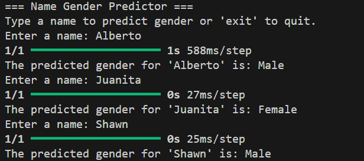

# ML Project: Name Gender Predictor (CLI)

## Overview
This project is based on idea to classify the name based on the gender. The goal is to predict the right gender from the name. It's a just-for-fun project to gain more experience of using keras.

## Features
- **CLI Program**: User can input a name (especially the first name), and get the result in the terminal.
- **Multiple takes**: User can do multiple test (will loop forever). Press `Ctrl + C` or input "exit" to quit.

## Tools used

## Future Improvement
- Will tidy up the code and improve the display
- Increasing the accuracy